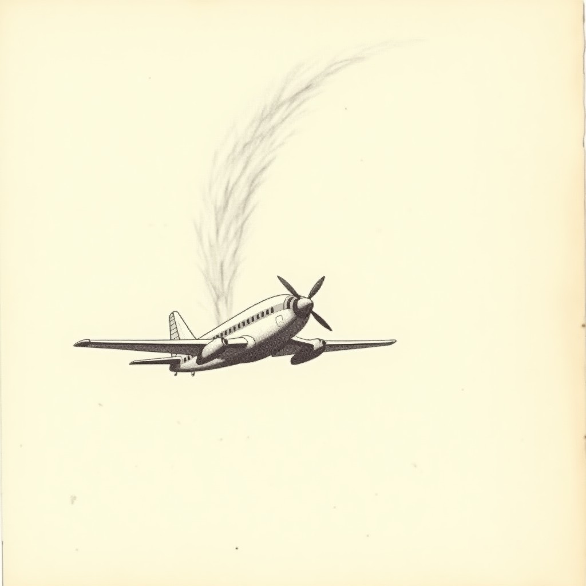

# gyro-squadron-45 — Project Diary

*Phase-by-phase log. Entries append, never rewrite. Nothing is done until its wall is green twice.*

---
## 2026-09-22 13:19 — Milestone 1 — tilt as tested math

The riskiest part first: gravity-truth tilt steering with calibration, dead zone, quadratic curve, bounds clamps, touch fallback — all as an injectable input source CI can drive without a phone. 17+17 plus a full-tilt sway soak.

## 2026-09-22 13:19 — Milestone 2 — the Act 1 arsenal

Four weapon tiers, kill-charged Super Shot, bombs, fighter and bomber brains, the fortress boss in two phases, a 55-second escalating stage with clear tally. 24+24 green; the eat-everything run dies honestly and retries.

## 2026-09-22 13:22 — Lore recovered

A found document from the world (see LORE.md) and its sketch now live in this repo's diary_images. Oddworld law: the game's instructions are artifacts of its own world.

## 2026-09-22 23:51 — ROADMAP: M3→M6 to itch

Steps: 1) M3 (building now): powerup gating + escorts + Act 2 (jet + turret + proto_mech boss). 2) M4: Act 3 futuristic content (UFO scout + mecha_transform enemies + alien_core final boss with 3 phases). 3) M5: title screen + audio + difficulty tiers. 4) M6: full verify-retry pass across all acts + export. 5) itch page + butler push + critic playtest. DONE: M1 M2 green (82 checks), repo live, lore (pilot letter) + sketches complete.

## 2026-09-22 23:52 — ROADMAP to itch

1) M3 (building): escorts + Act2. 2) M4: Act3 + alien_core boss. 3) M5: title + audio + difficulty. 4) M6: full verify + export + itch + critic. DONE: M1+M2 green (82 checks).

